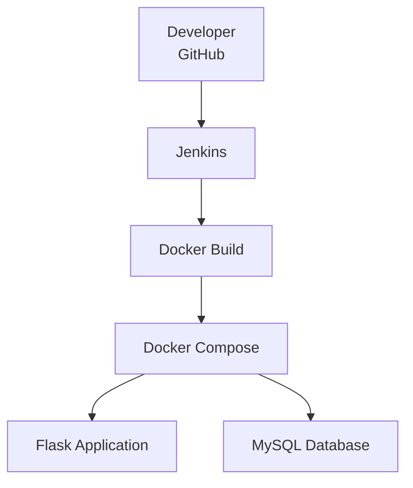

# Flask MySQL CI/CD Pipeline – vibhakar246

This project demonstrates a fully automated CI/CD pipeline to deploy a two-tier Flask + MySQL application on a local Ubuntu machine using Jenkins, Docker, and Docker Compose.

---

## 🚀 Tech Stack

- Flask (Python)
- MySQL
- Docker & Docker Compose
- Jenkins (CI/CD)
- GitHub
- Ubuntu (Local Machine)

---

## 🧩 Architecture

- Flask application runs in a Docker container  
- MySQL database runs in a separate container  
- Jenkins automates build and deployment  
- Docker Compose manages the multi-container setup

  
🧩 Architecture Diagram





---


## 📁 Project Structure

```text
flask-mysql-cicd-vibhakar246/
├── app/
│   ├── app.py
│   ├── requirements.txt
│   └── Dockerfile
│
├── mysql/
│   └── init.sql
│
├── docker-compose.yml
├── Jenkinsfile
└── README.md
```


---

## ⚙️ How CI/CD Works
1.Code is pushed to GitHub

2.GitHub webhook triggers Jenkins (via ngrok)

3.Jenkins pulls the latest code

4.Docker images are built automatically

5.Containers are deployed using Docker Compose

6.Flask application runs locally on http://localhost:5000

---

## 👨‍💻 Author

**Vibhakar Singh**  
GitHub: [https://github.com/vibhakar246](https://github.com/vibhakar246)


CI test Thu Dec 18 17:37:33 IST 2025
# webhook final working
